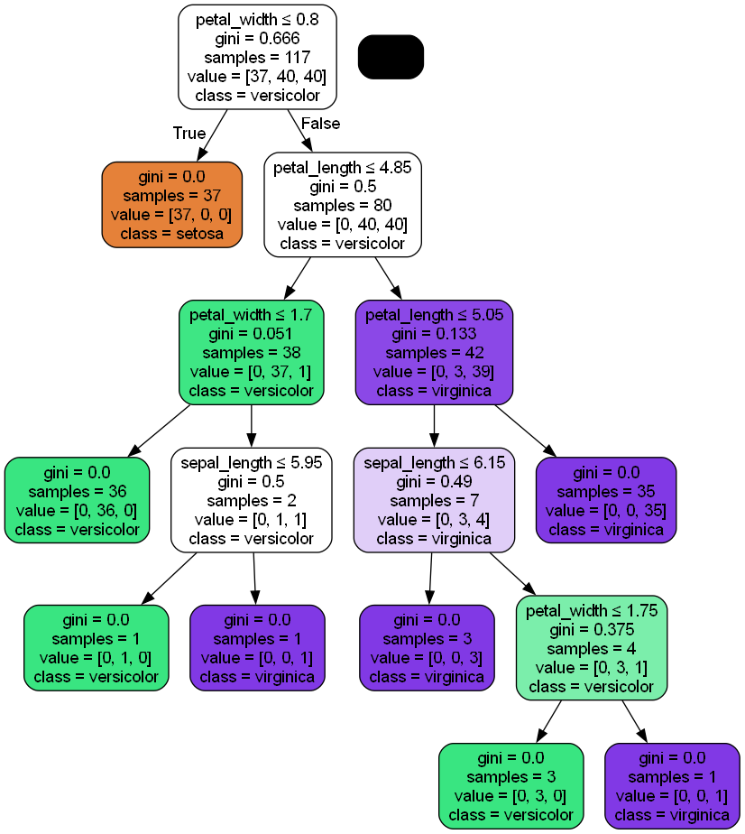

# 🌸 Decision Tree & Ensemble Classification on Iris Dataset

## 📌 Project Overview
This project applies **Decision Tree and Ensemble Learning** techniques to classify flower species in the **Iris dataset**. We explore **Decision Trees**, **Random Forest**, **AdaBoost**, and **Gradient Boosting** to enhance classification accuracy. Model performance is evaluated using key metrics like **accuracy, precision, recall, and F1-score**.

## 📂 Dataset
The **Iris dataset** consists of 150 samples across three species:
- **Setosa**
- **Versicolor**
- **Virginica**

Each sample includes **four features**:
- Sepal length  
- Sepal width  
- Petal length  
- Petal width  

## 🚀 Techniques Used
- **Decision Tree Classifier**
- **Random Forest Classifier**
- **Gradient Boosting Classifier**
- **Feature Importance Analysis**
- **Performance Evaluation**

## 📊 Performance Metrics
The models are evaluated using:
- Accuracy
- Precision
- Recall
- F1-Score
- Confusion Matrix

## Sample UI

Here’s an example of the application’s interface:

---

## Contact

- **MALLIKARJUN**  
  Data Science
  [GitHub](https://github.com/Mallikarjun-B-Patil) | [LinkedIn](https://www.linkedin.com/in/mallikarjunpatil4472/)
